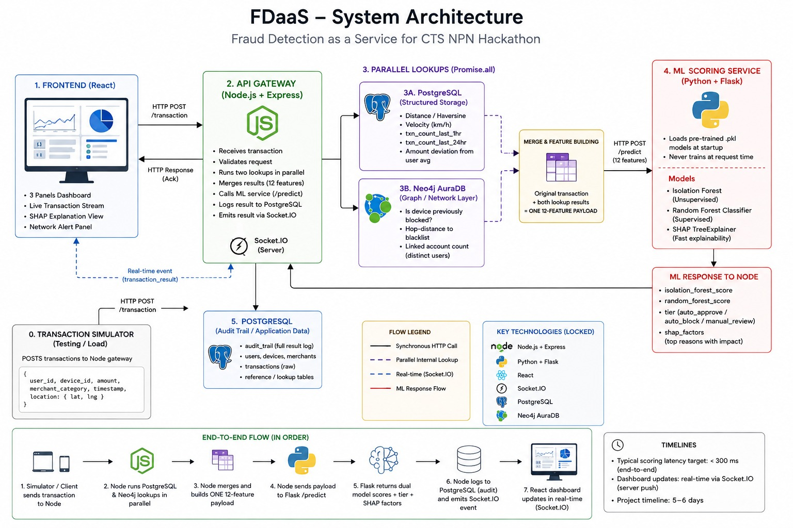
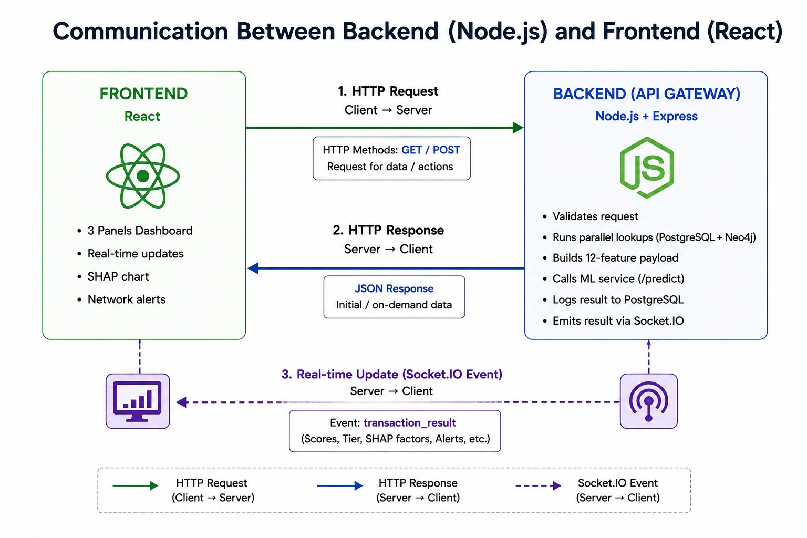
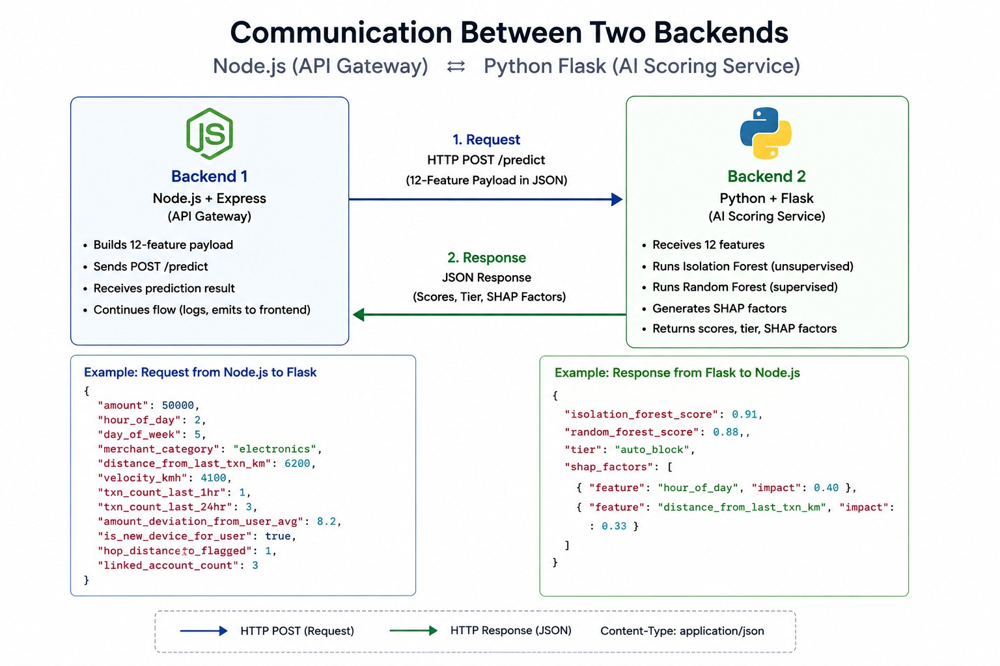

<div align="center">

# AEGIS — Fraud Detection as a Service (FDaaS)

**A real-time, explainable, ring-aware fraud detection prototype**
built for the Cognizant (CTS) NPN Hackathon

[](#tech-stack)
[](#tech-stack)
[](#tech-stack)
[](#tech-stack)
[](#tech-stack)
[](#tech-stack)

</div>

---

## Overview

Given a credit card transaction (amount, merchant type, location, frequency, time), **AEGIS** returns one of three verdicts — **`auto_approve`**, **`auto_block`**, or **`manual_review`** — backed by:

- **Two independent models** (an unsupervised Isolation Forest + a supervised Random Forest) whose *agreement* decides the tier, not a single threshold.
- **SHAP explainability** on every score — not just "fraud," but *why*.
- A **device/account graph layer (Neo4j)** that catches fraud rings — devices shared across multiple accounts — before any single device is individually blocklisted.
- **Leakage-safe feature engineering**: rolling velocity windows, merchant-category deviation, new-device flags, all computed only from a user's prior transactions.
- **Strict Data Synchronization**: The Node.js gateway handles strict mathematical formatting before reaching the ML engine, including calculating Haversine distances and properly mapping JavaScript's `Sunday=0` Date index to Pandas' `Monday=0` format.

> Full system design lives in [`docs/architecture.md`](docs/architecture.md). Exact JSON contracts every service must match live in [`docs/contracts.md`](docs/contracts.md). **Read both before writing code for your component** — the contracts are locked and every service depends on the field names matching exactly.

---

## Architecture Diagrams

### System Architecture — End-to-End Flow
Simulator → Gateway → parallel Postgres/Neo4j lookups → feature merge → ML scoring → Socket.IO → Dashboard.

<p align="center">
  
</p>

### Frontend ↔ Backend Communication
How the React dashboard talks to the Node gateway — HTTP for REST requests, Socket.IO for live pushes.

<p align="center">
  
</p>

### Gateway ↔ ML Service Communication
The exact contract between Node.js (API Gateway) and Python/Flask (AI Scoring Service).

<p align="center">
  
</p>

---

## Machine Learning & Explainability Pipeline

The ML service (`ml-service/`) runs as an isolated microservice that decouples heavy mathematical scoring and explainability computations from the real-time API Gateway.

<p align="center">
  
</p>

### 1. The 12 Locked Features
The scoring engine evaluates transactions across 12 behavioral, geospatial, and network features engineered to prevent data leakage:

| Feature Name | Type | Description |
|---|---|---|
| `amount` | `float` | Transaction amount in USD / base currency |
| `hour_of_day` | `int` | Hour in UTC (0–23) |
| `day_of_week` | `int` | Day of week (0=Monday ... 6=Sunday, synchronized with Pandas) |
| `merchant_category` | `categorical` | Categorical label encoded (e.g., `dining`, `electronics`, `travel`) |
| `distance_from_last_txn_km` | `float` | Haversine distance from the user's previous transaction coordinates |
| `velocity_kmh` | `float` | Implied transit speed based on time delta between transactions |
| `txn_count_last_1hr` | `int` | Rapid burst velocity count in the trailing 60 minutes |
| `txn_count_last_24hr` | `int` | Volume counter in the trailing 24 hours |
| `amount_deviation_from_user_avg` | `float` | Relative deviation z-score against the user's historical spend average |
| `is_new_device_for_user` | `bool` | Flag indicating an unassociated hardware fingerprint |
| `hop_distance_to_flagged` | `int` | Neo4j graph distance to the nearest confirmed fraud node (`-1` = clean, `0` = direct, `1` = ring) |
| `linked_account_count` | `int` | Number of distinct user accounts sharing this hardware device |

### 2. Dual-Model Architecture & Decision Boundaries
Rather than trusting a single black-box threshold, AEGIS evaluates two independent paradigms in parallel:

1. **Supervised Classifier (`RandomForestClassifier`)**:
   * Evaluates historical behavioral fraud patterns and non-linear interactions across high-risk merchant categories and velocities.
   * Outputs a calibrated class probability $P(\text{Fraud}) \in [0.0, 1.0]$.
2. **Unsupervised Anomaly Detector (`IsolationForest`)**:
   * Measures multi-dimensional point isolation to detect novel, zero-day spending anomalies without relying on historical fraud labels.
   * Outputs a continuous offset anomaly score.
3. **Threshold Calibration & Business Engine (`gateway/src/routes/evaluateRisk.js`)**:
   * **`AUTO_APPROVE`**: Both models agree the pattern is safe (RF < 0.30 and ISO < 0.15).
   * **`AUTO_BLOCK`**: Direct Hop-0 fraud syndicate link detected in Neo4j.
   * **`MANUAL_REVIEW`**: Disagreement between models, Impossible Travel velocity (> 1000 km/h), or unusual high-amount spikes.

### 3. Real-Time Explainable AI (SHAP TreeExplainer)
For every transaction evaluated, the ML engine runs `shap.TreeExplainer` on the Random Forest model to generate exact mathematical local feature attribution weights (positive risk drivers vs. negative mitigating factors). This feeds directly into the forensic investigation drawer on the dashboard so fraud analysts see exactly *why* a transaction scored high in milliseconds.

---

## Tech stack

| Layer | Technology | Notes |
|---|---|---|
| API gateway | Node.js + Express | Orchestrates everything, owns Socket.IO |
| Structured storage | PostgreSQL | Distance/velocity math happens in application code (Haversine), not the database |
| Graph/network layer | Neo4j AuraDB | Cloud-hosted, free tier |
| AI scoring | Python + Flask | Loads pre-trained `.pkl` models at startup, never trains at request time |
| Models | scikit-learn | `IsolationForest` + `RandomForestClassifier` + SHAP `TreeExplainer` |
| Frontend | React + Vite + Tailwind | 4-page SaaS SPA via React Router (Landing, Dashboard, Docs, Graph) |
| Real-time transport | Socket.IO | Server push, not client polling |
| Dataset | Sparkov (Kaggle) | Chosen over IEEE-CIS (no location) and ULB (PCA-anonymized, kills explainability) |

## Repo layout

```text
fdaas/
├── docs/
│   ├── architecture.md      full system design
│   ├── contracts.md         exact JSON shapes every service must match
│   ├── demo-script.md       choreographed demo sequence
│   └── images/              architecture diagrams (this README)
├── gateway/                 Node.js/Express — orchestration, Postgres + Neo4j lookups
├── graph/                   Neo4j seed data + Cypher queries
├── ml-service/              Flask app, training scripts, models/
├── frontend/                React Vite SPA (Landing, Live Dashboard, API Docs, Graph)
├── simulator/               Sends synthetic transactions to the gateway
├── schema.sql               PostgreSQL table + index definitions
└── docker-compose.yml
## Running it locally

### 0. Prerequisites
- Node.js 18+, Python 3.10+, Docker
- A free [Neo4j AuraDB](https://neo4j.com/cloud/aura/) instance (connection URI + credentials)

### 1. Clone and configure
```bash
git clone https://github.com/anandavardhan68/Cts-hackathon.git
cd Cts-hackathon
```
Copy every `.env.example` to `.env` in each service folder (`gateway/`, `ml-service/`, `frontend/`) and fill in real values — Neo4j credentials, Postgres connection string, service ports.

### 2. Start PostgreSQL and load the schema
```bash
docker compose up -d
psql -h localhost -U postgres -d fdaas -f schema.sql
```

### 3. Prepare the dataset and train the models
```bash
cd ml-service
pip install -r requirements.txt
python prepare_dataset.py   # cleans Sparkov data, builds the synthetic device graph
python train.py             # trains + saves models/*.pkl
```

### 4. Seed the Neo4j graph
```bash
cd ../graph
npm run seed
```

### 5. Seed Postgres with historical transactions
```bash
cd ../gateway
npm run seed
```

### 6. Start the services (separate terminals)
```bash
# ML service
cd ml-service && python app.py            # http://localhost:5001

# Gateway
cd gateway && npm start                   # http://localhost:4000

# Frontend
cd frontend && npm install && npm start   # http://localhost:3000
```

### 7. Run the simulator
```bash
cd simulator && python simulate.py --loop     # random continuous traffic
python simulate.py                            # choreographed demo sequence
```

Open the dashboard and watch transactions stream in with live tier verdicts, SHAP explanations, and (when relevant) fraud-ring alerts.

